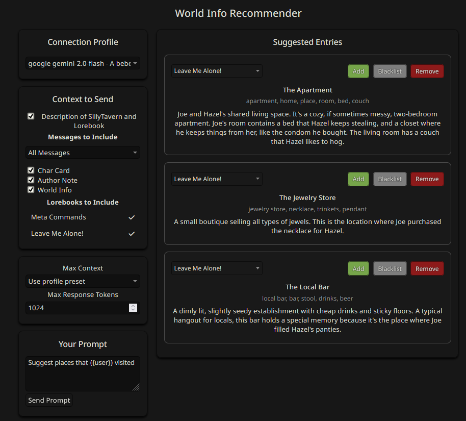
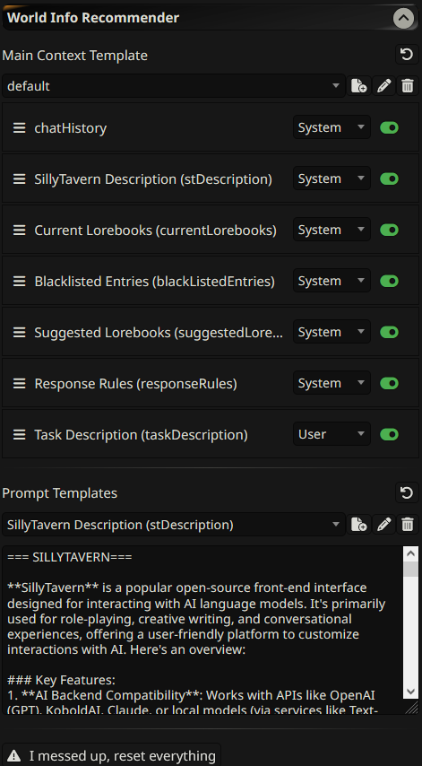
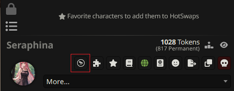

# SillyTavern World Info Recommender (WREC)

## Overview

A [SillyTavern](https://docs.sillytavern.app/) extension that helps you manage [world info](https://docs.sillytavern.app/usage/core-concepts/worldinfo/) based on the current context with LLMs using [connection profiles](https://docs.sillytavern.app/usage/core-concepts/connection-profiles/).



---



---

**If you are using a _Text Completion_ profile, make sure your profile contains API, preset, model, system prompt, instruct template, and  context template.**

**If you are using a _Chat Completion_ profile; API, settings, model would be enough.**

---

## Installation

Install via the SillyTavern extension installer:

```txt
https://github.com/bmen25124/SillyTavern-WorldInfo-Recommender
```

To open the recommender popup, click the extension icon:



## Demo Video

**Simple Usage:**

https://github.com/user-attachments/assets/a26c8e44-7087-42df-9afa-7f7a2c752359

**Chat with LLM:**

https://github.com/user-attachments/assets/eb78f7ca-8a5a-4119-a44a-9857f22ec350

## FAQ

>Can I use this with my local 8B/12B RP model?

You should test it, but my guess is no. Because the model needs to give _XML_ output. RP models might not be able to do that.

>Can you suggest a model?

Gemini models are cheap, fast, and efficient. I usually use Gemini Flash 2.0. But most decent models should work fine.

> I'm getting "No results from AI/Invalid XML" error.

- Make sure your max response tokens are set high enough to accommodate the response. Try increasing it to 2000/more. Or prompt the entry limit to a smaller number. Like *"Only give me a maximum of 2 entries."*
- Please don't try to use a fancy chat completion preset. They are made for RP. Not for generating structured XML output. So, create a connection profile with the default preset.
- As I said in the first question, make sure your model is capable of generating structured XML output.
